# Capstone Project Azure Machine Learning Engineer

This project gives me the opportunity to use the knowledge you have obtained from this Nanodegree to solve an interesting problem. In this project, I created two models: one using Automated ML (denoted as AutoML from now on) and one customized model whose hyperparameters are tuned using HyperDrive. Then I compared the performance of both the models and deploy the best performing model.

## Dataset

### Overview

This dataset is originally from the National Institute of Diabetes and Digestive and Kidney Diseases. The objective of the dataset is to diagnostically predict whether or not a patient has diabetes, based on certain diagnostic measurements included in the dataset. Several constraints were placed on the selection of these instances from a larger database. In particular, all patients here are females at least 21 years old of Pima Indian heritage.
https://www.kaggle.com/uciml/pima-indians-diabetes-database

The datasets consists of several medical predictor variables and one target variable, Outcome. Predictor variables includes the number of pregnancies the patient has had, their BMI, insulin level, age, and so on.
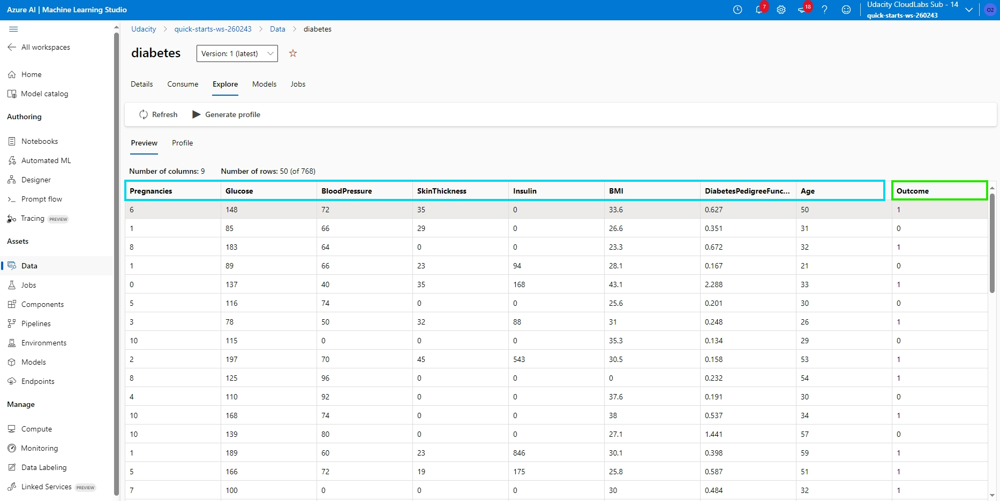

### Task

Predict the “Outcome” column based on 8 input features, whether the patient has diabetes or not.

### Access

Data were got from the external link below and register with dataset in my workspace

```
dataset = Dataset.Tabular.from_delimited_files('https://raw.githubusercontent.com/dokiem/AZMLFinalProject/main/diabetes.csv')        
dataset = dataset.register(workspace=ws,
                            name=key,
                            description=description_text)
```

## Automated ML

I choosed a classclassification task with the target column `Outcome`, the param enable_early_stopping is true. 
I also set experiment_timeout_minutes = 30, max_concurrent_iterations = 4, primary_metric = 'accuracy', n_cross_validations = 5 and 24 iterations (number of iteration to be performed to prepare the model) for automl settings. 

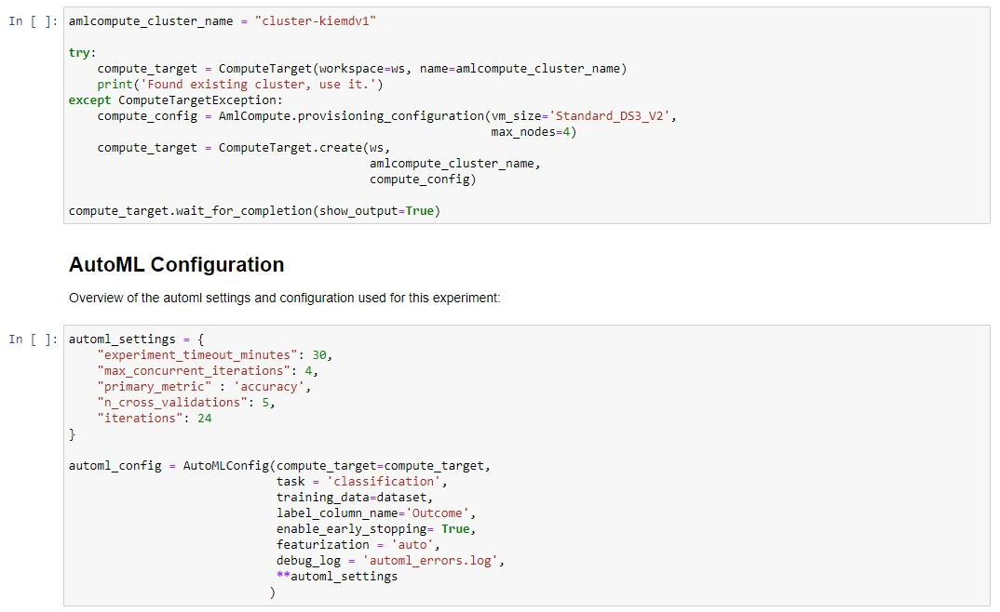

### Results

The best model from AutoML is StackEnsemble with accuracy of 0.78780. You can see detail in the screenshot below.
We can improve our model by some ways:
- Increase number of iterations, experiment timeout, max_concurrent_iterations
- Preprocessing data

The screenshot of the `RunDetails` widget as well as a screenshot of the best model trained with it's parameters

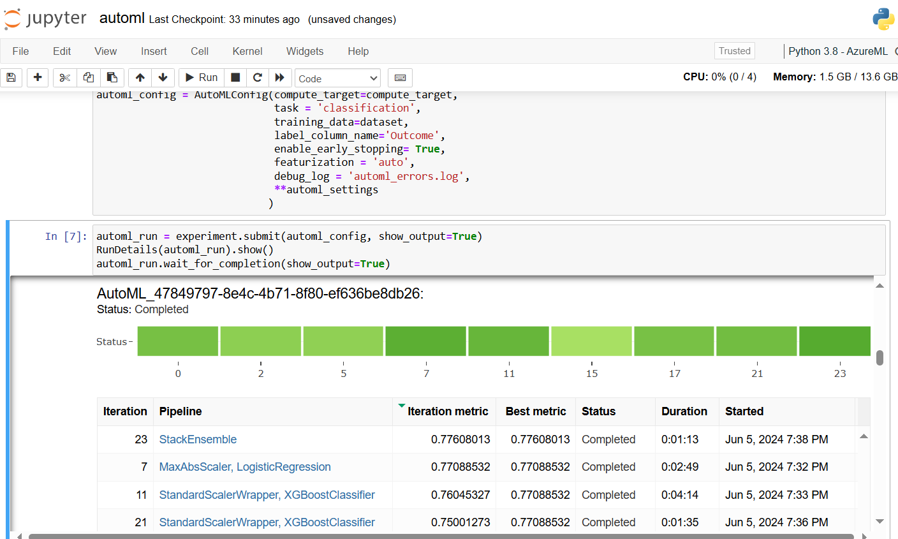
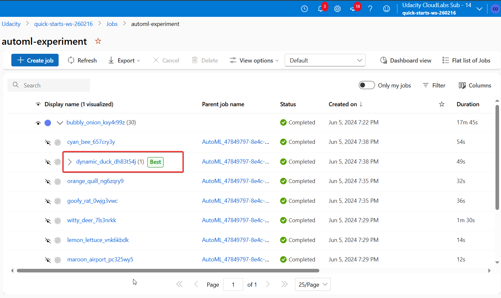
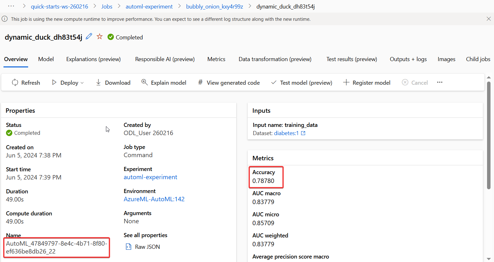
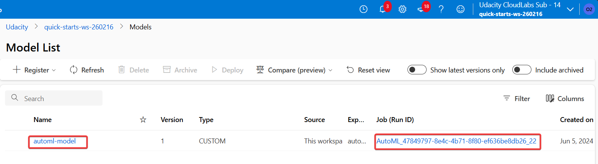

## Hyperparameter Tuning

I chosed the algorithm `Logistic Regression` with HyperDrive for this experiment because the target column output is 1 or 0. 
I set parameters for the hyper dirve as below

```
early_termination_policy = BanditPolicy(slack_factor = 0.1, evaluation_interval=2, delay_evaluation=5)

ps = RandomParameterSampling(
    {
        '--C': choice(0.01, 0.1, 0.3, 0.6, 0.7, 1.0),
        '--max_iter': choice(range(10,110,10))
    }
)
```
### Results
The best run from Hyperdrive had accuracy is 0.811688 with C of 0.3 and max_iter of 100
We can improve our model by some ways:
- Try to use GridParameterSampling or BayesianParameterSampling
- Add more RandomParameterSampling
- Increase max_total_runs

The screenshot of the `RunDetails` widget as well as a screenshot of the best model trained with it's parameters
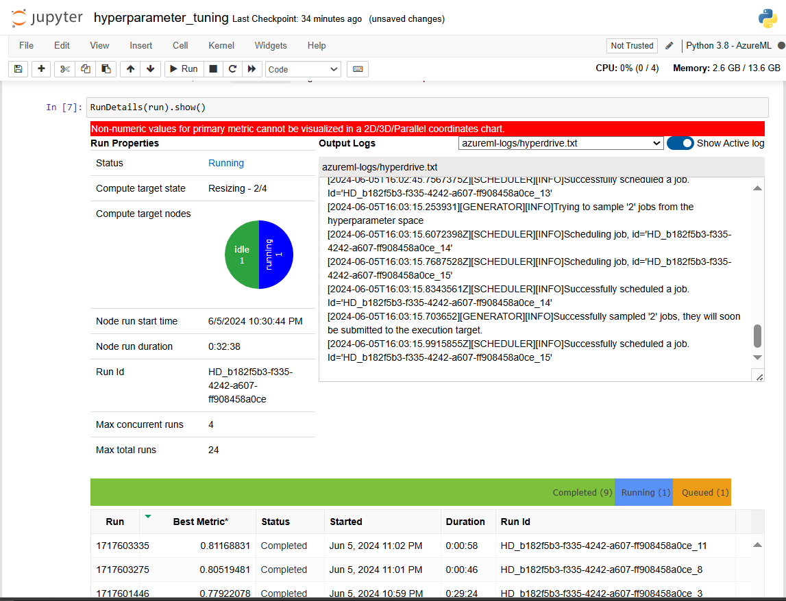
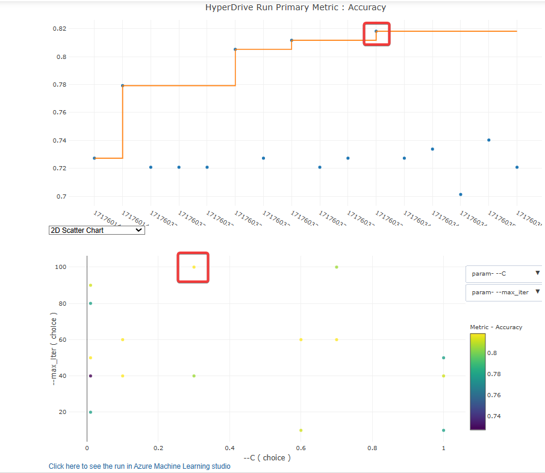
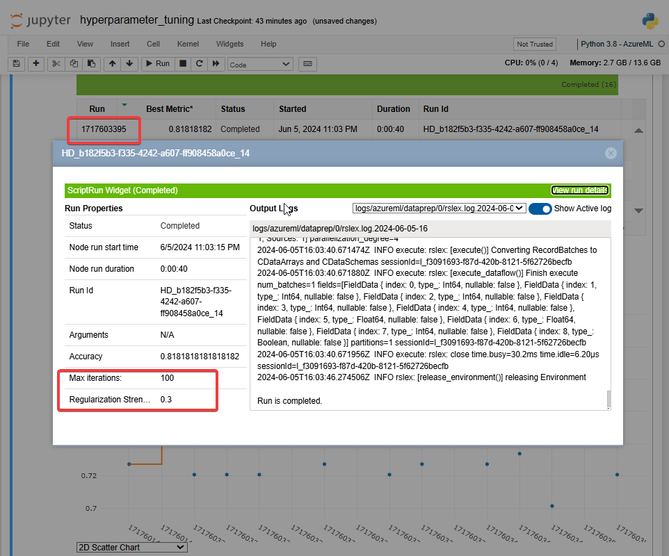

## Model Deployment

After training of the two approaches, we can see the accuracy of the hyperdrive model is better than the automl. Therefore, I registered and deployed for the best run of the hyperdrive model.

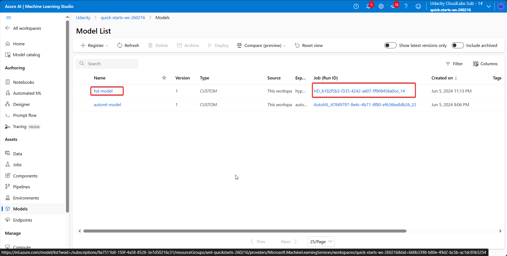
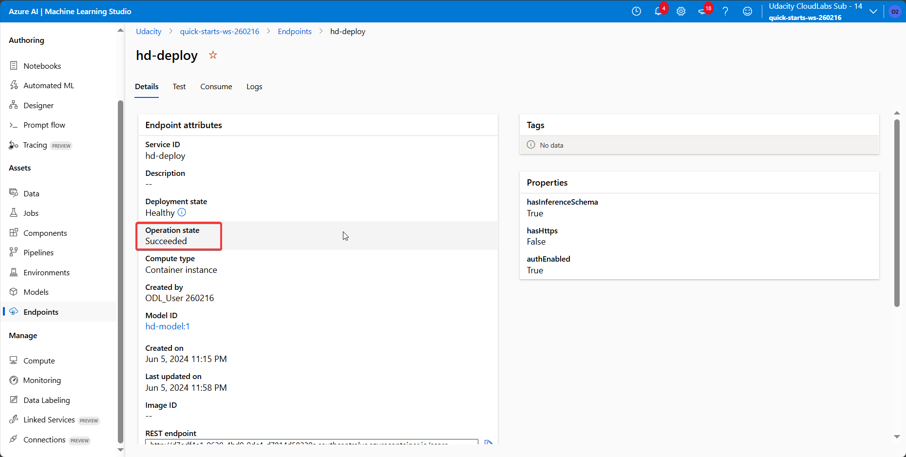
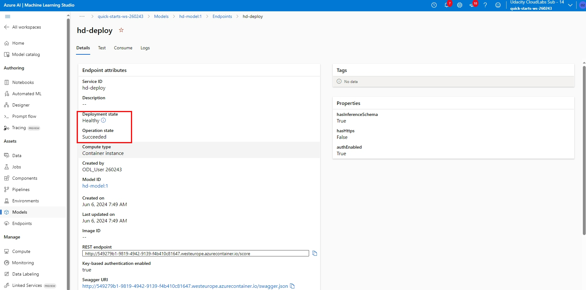
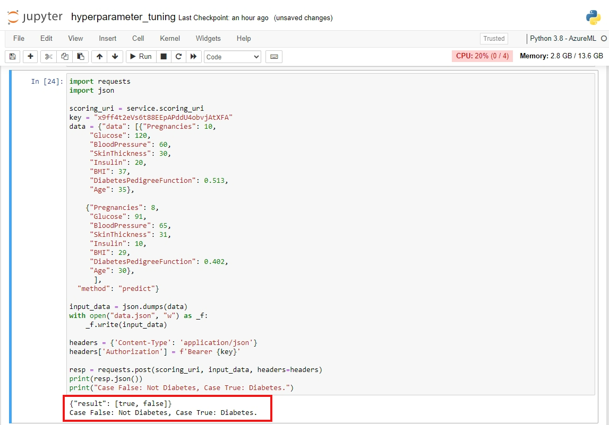

## Screen Recording
The screen recording is uploaded to youtube: [https://youtu.be/9lTCwMDG650](https://youtu.be/KW25KyFWPkA)
